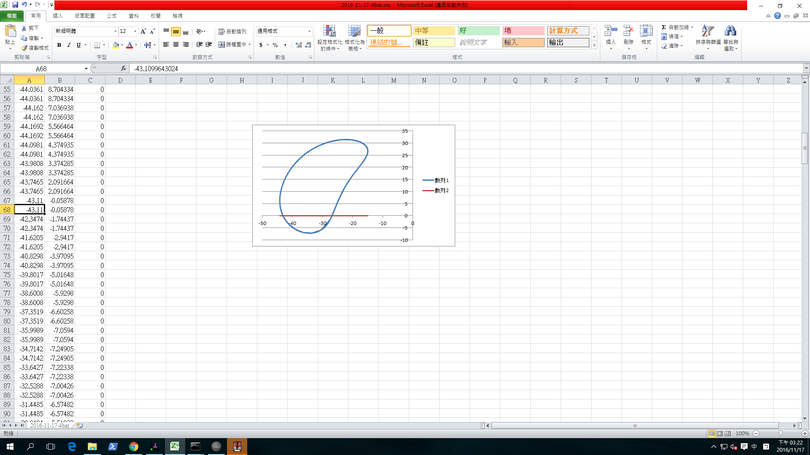
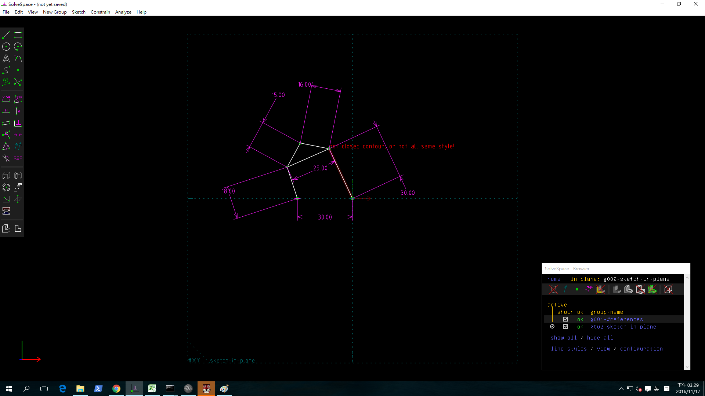
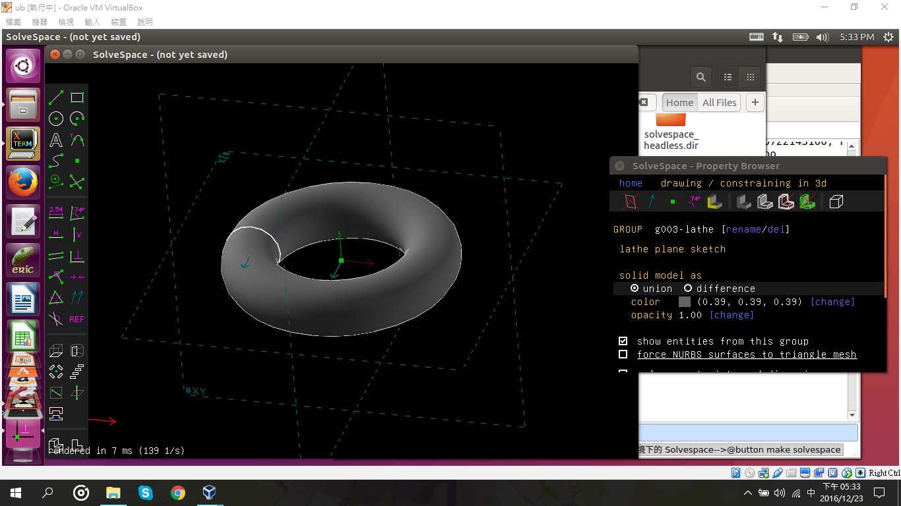
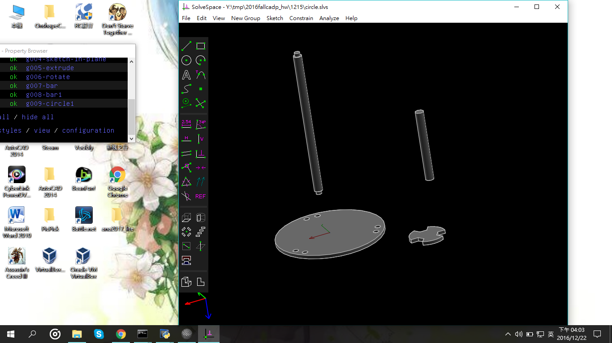
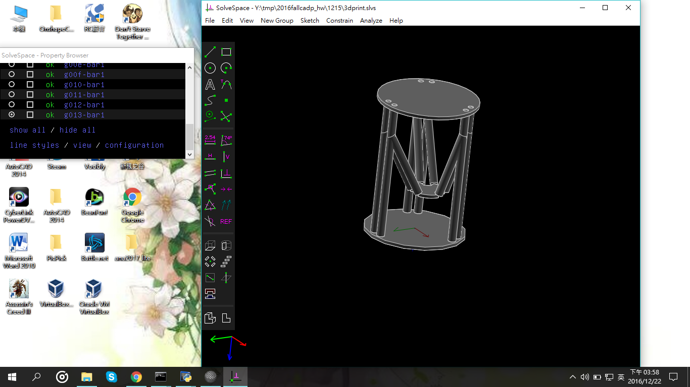

Title: 電腦輔助設計實習課程總結
Date: 2017-1-12 12:00
Category: 作業
Tags: 作業
Author: 40423112

課程總結
===

<!-- PELICAN_END_SUMMARY -->

9/21 四連桿機構
===
 

<iframe src="https://player.vimeo.com/video/199280777" width="640" height="361" frameborder="0" webkitallowfullscreen mozallowfullscreen allowfullscreen></iframe>

<a href="https://vimeo.com/199280777">錄製_2017_01_13_15_00_10_259</a> from <a href="https://vimeo.com/user44207235">吳欣奕</a> on <a href="https://vimeo.com">Vimeo</a>.

9/22 筆記 
===
###9/22筆記 

1.創2016fallcadp_hw 

將readme打勾 

格式:python 加密:agpl 

新增gh-pages分支 

進入setting 點branches 

將master變更為gh-pages 

update 

2.git clone 2016fallcadp_hw 

cd 2016fallcadp_hw 

git branch 

git checkout gh-pages

git branch

3.學號.github.io 

將README打勾 

格式:python 加密:agpl 

點選create new file 

打入index.html 點commit new file 

4.創 2016fallcadp_ag6 

將README打勾 

格式:python 加密:agpl 

將2016fallcadp_ag100 clone

cd 2016fallcadp_ag100 git branch git checkout gh-pages git branch

git submodule add -b gh-pages https://github.com/學號/2016fallcp_ag6 學號

git staus(檢查) 依序將隊友的資料夾加入

###個人BLOG

 [個人作業網誌](https://40423112.github.io/2016fallcadp_hw/) 

###設定PROXY 

git config --global https.proxy http://proxy.mde.tw:3128 

git config --global http.proxy http://proxy.mde.tw:3128 

###如何把組員Hw拉回組的倉儲

git clone 2016fallcpa cd 2016fallcpa

git submodule add -b gh-pages https://github.com/學號/2016fallcp_ag6 學號
 

(表示要追蹤子模組的 gh-pages branch)

git submodule init,利用 git submodule update

git pull origin gh-pages --recurse-submodules

git submodule foreach "(git checkout gh-pages; git pull)&"

git submodule update --init --recursive

10/27 solvespace 
===

<iframe src="https://player.vimeo.com/video/185684438" width="640" height="341" frameborder="0" webkitallowfullscreen mozallowfullscreen allowfullscreen></iframe>

<a href="https://vimeo.com/185684438">錄製_2016_10_06_01_40_51_166</a> from <a href="https://vimeo.com/user44207235">吳欣奕</a> on <a href="https://vimeo.com">Vimeo</a>.

 

11/17 四連桿機構 
===

11/24 利用sovlespace功能 
===

1.parts(零件繪製)
----
範例檔案:  <a href="http://solvespace.com/bracket.pl">http://solvespace.com/bracket.pl</a>
An introductory tutorial is available, in which we draw the same part that is shown in the demo video.

This covers most of the basic features of SolveSpace, including sketches, constraints, extrusions, and Boolean operations.

When we first run SolveSpace, we will begin with an empty part. Initially, our view of the part will be oriented onto the XY plane; the label for that plane is displayed at the bottom left of the screen (#XY, in dark grey). The axes are also indicated by the three colored arrows at the bottom left; the X, Y, and Z axes are drawn in red, green, and blue respectively.

When we hover the mouse over any entity, constraint, or other object in the sketch, that object will appear highlighted in yellow. For example, the XY plane, which is drawn as a dashed square, will appear highlighted when we hover the mouse over it. The YZ and ZX planes initially look like dashed lines, because they are being viewed on edge; but they still appear highlighted in yellow when we hold the mouse over them. It is similarly possible to highlight the X, Y, and Z axes (which are drawn as arrows), or the origin (which like all points is drawn as a green square).

Extrude (平行長出)
----

<iframe src="./../data/threejs/extrude.html" width="800" height="600"></iframe>

<iframe src="https://player.vimeo.com/video/199280036" width="640" height="361" frameborder="0" webkitallowfullscreen mozallowfullscreen allowfullscreen></iframe>

<a href="https://vimeo.com/199280036">錄製_2017_01_13_14_44_06_340</a> from <a href="https://vimeo.com/user44207235">吳欣奕</a> on <a href="https://vimeo.com">Vimeo</a>.

Extrude (除料)
---- 

<iframe src="./../data/threejs/extrude2.html" width="800" height="600"></iframe>

<iframe src="https://player.vimeo.com/video/199280040" width="640" height="361" frameborder="0" webkitallowfullscreen mozallowfullscreen allowfullscreen></iframe>

<a href="https://vimeo.com/199280040">錄製_2017_01_13_14_48_41_541</a> from <a href="https://vimeo.com/user44207235">吳欣奕</a> on <a href="https://vimeo.com">Vimeo</a>.

Lathe (旋轉繞行長出或除料)
----

<iframe src="./../data/threejs/lathe.html" width="800" height="600"></iframe>

<iframe src="https://player.vimeo.com/video/199280188" width="640" height="361" frameborder="0" webkitallowfullscreen mozallowfullscreen allowfullscreen></iframe>

<a href="https://vimeo.com/199280188">錄製_2017_01_13_14_51_45_140</a> from <a href="https://vimeo.com/user44207235">吳欣奕</a> on <a href="https://vimeo.com">Vimeo</a>.

Linkages (fourbar & multilink) (四連桿與多連桿運動模擬) ----

四連桿:利用線架構完成四連桿模擬後, 將 3D 零件以點重合, 點在面與點在線上約束各連桿後完成.

2. Assembly (零件組立) 
---

<iframe src="./../data/threejs/40423112.html" width="800" height="600"></iframe>

4. Compiled & API (編譯與延伸應用)
---

使用 Virtualbox 虛擬主機執行 Windows 64 位元與 Ubuntu 64 位元環境中的編譯與延伸應用

12/1 組合圖
===

<iframe src="./../W7/40423112-12-15.html" width="800" height="600"></iframe>

12/15 利用 solvespace 組裝3D列印機 
===

PNG
===

Solvespace
===
<iframe src="./../1215/dispersion.html" width="800" height="600"></iframe>

<iframe src="./../1215/40423112-3dprint.html" width="800" height="600"></iframe>

<iframe src="https://player.vimeo.com/video/199279014" width="640" height="361" frameborder="0" webkitallowfullscreen mozallowfullscreen allowfullscreen></iframe>

<a href="https://vimeo.com/199279014">錄製_2017_01_13_14_32_32_884</a> from <a href="https://vimeo.com/user44207235">吳欣奕</a> on <a href="https://vimeo.com">Vimeo</a>.

12/22 由小組分別組裝各個零件後在一起組裝錄製組裝影片
===

<iframe src="https://player.vimeo.com/video/199279485" width="640" height="361" frameborder="0" webkitallowfullscreen mozallowfullscreen allowfullscreen></iframe>

<a href="https://vimeo.com/199279485">錄製_2017_01_13_14_39_16_673</a> from <a href="https://vimeo.com/user44207235">吳欣奕</a> on <a href="https://vimeo.com">Vimeo</a>.

<iframe width="560" height="315" src="https://www.youtube.com/embed/NvfGaW3GUUA" frameborder="0" allowfullscreen></iframe>

